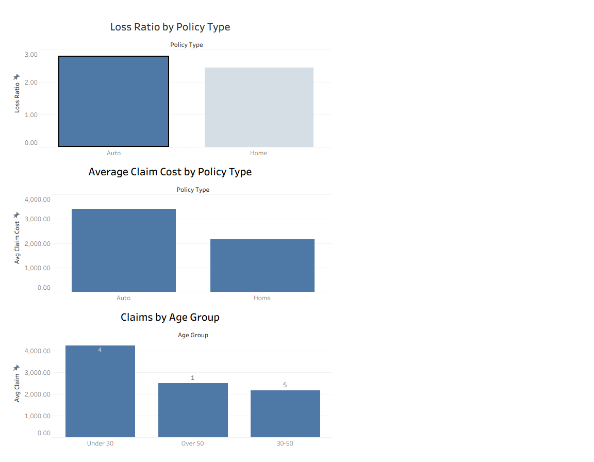

📊 Insurance Claims Risk Analysis Dashboard
Overview

This project analyzes insurance claims data to evaluate profitability, claim severity, and risk distribution across policy types and demographic segments. The goal is to identify key drivers of insurance losses and support data-driven decision-making.

🧰 Tools Used

Tableau

SQL (MySQL)

CSV datasets

📊 Key Analysis Performed

Calculated loss ratio by policy type

Measured average claim cost by policy type

Analyzed claims distribution by age group

📈 Key Insights

Auto policies show higher loss ratios compared to home policies

Younger policyholders tend to have higher average claim costs

Claim frequency and severity vary significantly by age group

## 📷 Dashboard Preview

🔗 View interactive dashboard: https://public.tableau.com/app/profile/larry.zelnick/viz/InsuranceClaimsRiskAnalysisDashboard_17739569413630/Dashboard1?publish=yes

📌 Business Value

This analysis helps insurers identify high-risk segments, optimize pricing strategies, and improve profitability through better risk assessment.
